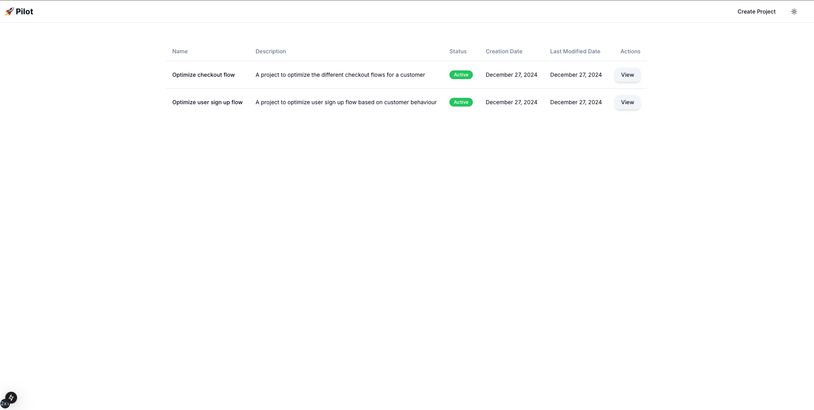
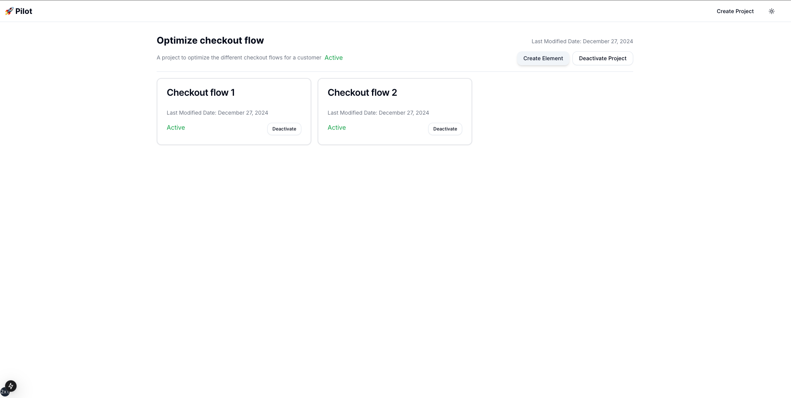

<h1 align="center" style="border-bottom: none;">Pilot 🚀</h1>
<p align="center" style="color: gray;">Open source platform for experimentation through online learning</p>

## Setup

**Pre-requisite**

- The backend is hosted through [Supabase](https://supabase.com/), you need to create a project and set the `SUPABASE_URL` and `SUPABASE_ANON_KEY` environment variables
- There are two tables: `elements` and `projects`. The table definitions are location in the `src/backend/table_definitions` folder. You can use it to create the tables
- The model checkpoint is stored in a Supabase storage bucket called `model_checkpoints` which must be created manually
- Ensure the tables and storage bucket has the right RLS policy attached so that you can access them


**Start server locally**

```sh
cd src/backend
poetry run start-server
cd ../pilot-frontend
npm run dev
```

Navigate to [http:localhost:3000](http:localhost:3000) on your browser.

<p>
  
  
</p>

## API Definition
```
Project - Create a project which defines what you are trying to optimize/experiment. e.g. landing page, checkout flow etc. 

Element - Each project has few elements, each element identifies a specific component. e.g. landing page A, landing page B etc. 
```

Once you have created your project and elements created, you can make the following `GET` request to get a recommendation for a project. Note that each project and element is identified through an UUID

```
GET <URL>/projects/<project id>/recommendation
```

Based on the user behaviour, you can record a success or failure metric which will be used to update the model's priors. This can be achieved through a `POST` request

```
POST <URL>/projects/<project id>/record-action

{
    "element_id": "<element id>" // The element shown to user, e.g. the landing page
    "success": true/false // A success or failure value to capture how user reacted
}
```


## Philosophy
Rapid and continuous experimentation is the key to improving any product by learning from user behavior and understanding what the customers like. In the industry, A/B testing is the most common way to do this experimentation and iteration. This however, might not always be the best fit every time. For example, if you are looking to compare two different versions of your landing page, you would ideally run an A/B test to compare the two and pick the best performing (based on some metric). However, in the process of picking a generally performant landing page, you are ignoring factors such as demographics or seasonality that could have influenced your A/B test. A solution to this problem is an algorithm that can keep learning and adjust which page might work better at a given point in time for a given user. 